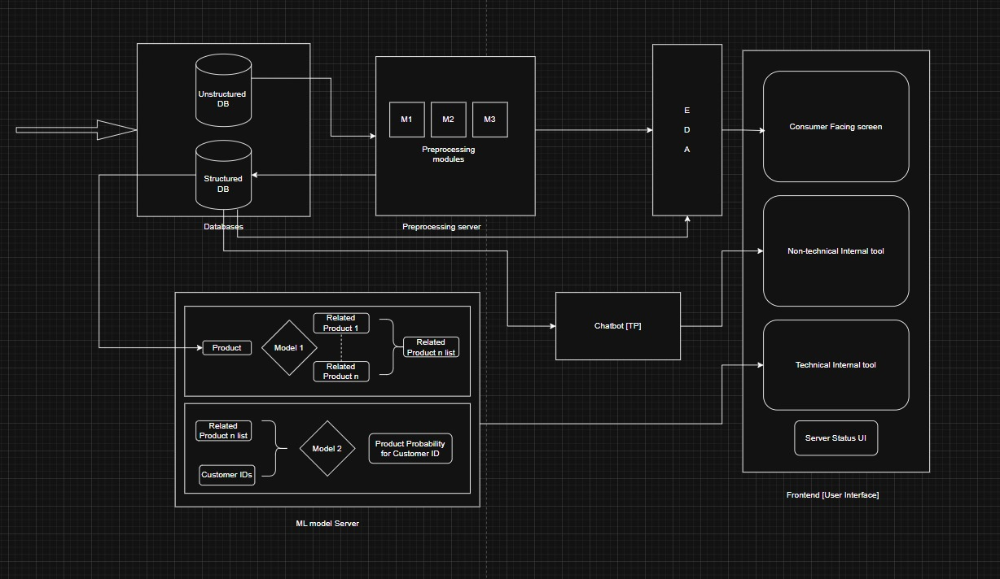
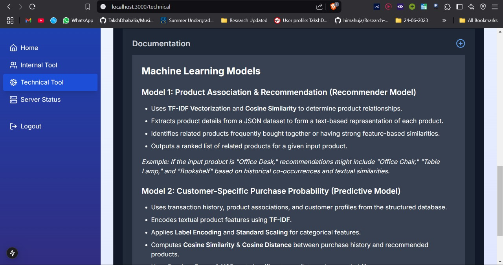
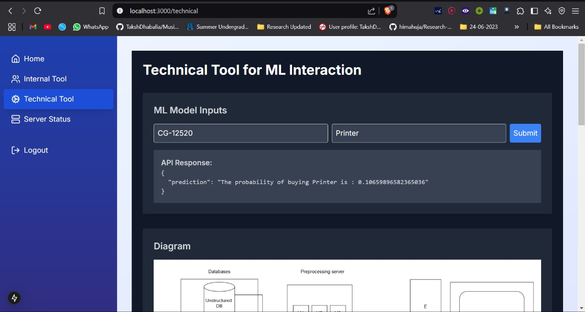
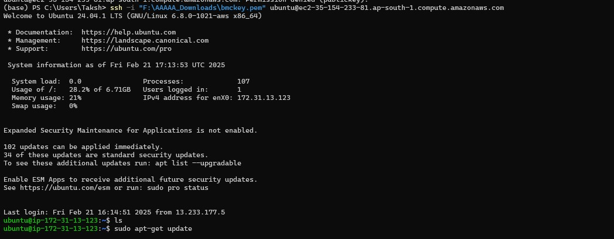
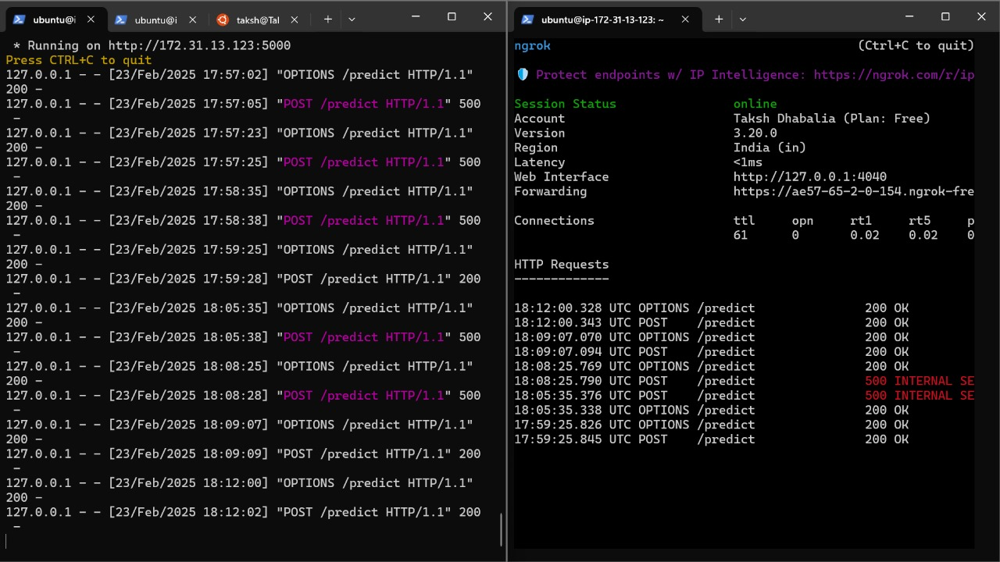

# 📊 Predicto — Winners , Hackademia .
# Project Documentation

*By students of MIT Kothrud*

---

## 📚 Introduction

Our product **Predicto** leverages **Machine Learning** to help the Marketing department personalize company websites by predicting the probability of a customer purchasing a relevant product. By analyzing past transactions, our solution enhances customer experience and drives sales by recommending relevant products.

---

## 📝 Problem Statement

The Marketing team wants to contextualize the website for customers by showcasing viable products they are likely to purchase. The goal is to build an **ML model** that predicts the likelihood of a customer buying a relevant product based on their purchase history.

---

## 🌟 Motivation

- Increase sales conversions by targeting customers effectively.
- Optimize marketing campaigns through data-driven decision-making.
- Improve customer experience through personalized recommendations.

---

## ✨ Key Features

- Website integration  
- Multi-level dashboard  
- Chatbot support for non-technical staff  
- User-friendly interface  

---

## 🛠️ System Architecture and Workflow





### 1. Data Ingestion

- Ingests data from structured databases, CRMs, and unstructured sources like Excel, CSV, API logs.
- Temporarily stored in an **unstructured database** before preprocessing.

### 2. Data Preprocessing on AWS EC2

- Dedicated **EC2 instance** handles cleaning, standardizing, structuring.
- Converts unstructured data to structured **Excel files** stored in **Supabase (PostgreSQL)**.

### 3. Machine Learning Models (on separate EC2)

#### Model 1: Product Association & Recommendation

- Uses **TF-IDF Vectorization** and **Cosine Similarity**.
- Creates ranked product recommendations based on co-occurrence and feature similarities.

#### Model 2: Customer-Specific Purchase Probability

- Uses **Random Forest** and **XGBoost classifiers**.
- Predicts customer-specific purchase probability for recommended products.

### 4. Exploratory Data Analysis

- Performs EDA to extract insights, detect trends, and refine recommendation logic.

### 5. Chatbot Integration for Real-Time Insights

- Integrated with **AskYourDatabase** chatbot.
- Allows querying sales data insights like top products, purchase behaviors using natural language.

### 6. User Interface for Different Stakeholders

- **Customers:** Personalized dashboards.  
- **Business & Marketing:** Internal tool for insights, sales tracking.  
- **Technical Teams:** ML model monitoring dashboard.  
- **Infrastructure:** Server status monitoring UI.  

---

## 🔄 Component Details

### Data Preprocessing

#### `product_info` Dataset

- Detected duplicate **productIDs**.
- Introduced **Variant ID** appending `-x` to the productID to resolve.

#### `customer_transaction_info` & `orders_returned_info`

- Merged with a `returned` flag.
- Combined multiple product quantities and profits for same customer/order.
- Standardized product mapping using the first **variantID**.
- Converted UNIX timestamps to readable date-time.
- Calculated `days since last purchase`.

#### `customer_info` Dataset

- Retained `pincode` as primary location feature.
- Dropped redundant fields.

#### `region_seller_info` Dataset

- Detected and noted typos and inconsistencies.
- Excluded irrelevant dataset.

---

## 🤖 ML Models

### Model 1: Product Association & Recommendation (Recommender Model)

**Objective:** Given a product keyword, return related products.

**Approach:**

- Loaded `products.json`.
- Applied **TF-IDF** vectorization on product names.
- Extracted top 50 features.
- Computed **Cosine Similarity** with search keywords.
- Returned top matching product IDs.

### Model 2: Customer-Specific Purchase Probability (Predictive Model)

**Objective:** Predict likelihood of a customer purchasing a product.

**Approach:**

- Merged transaction, customer, and product data.
- Defined binary target variable.
- Scaled numerical, one-hot encoded categorical data.
- Trained **XGBoost** model with regularization.
- Tuned hyperparameters:

```python
xgb_model = xgb.XGBClassifier(
    n_estimators=100,
    max_depth=4,
    learning_rate=0.03,
    colsample_bytree=0.7,
    reg_lambda=10,
    reg_alpha=5,
    objective="binary:logistic",
    random_state=42
)
